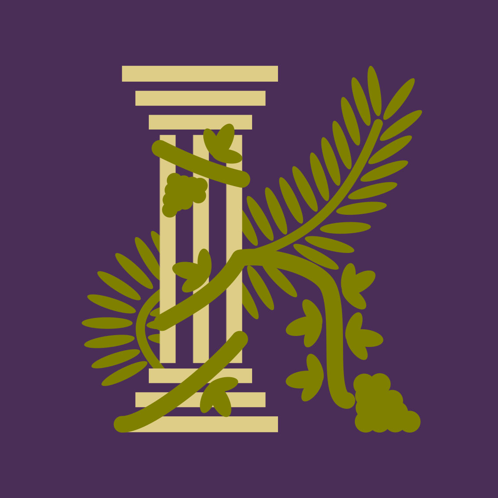

<div align="center">



# Kolirus

**Track food, reduce waste, and eat better.**

</div>

---

## Overview

Kolirus is a food organization app that helps you keep track of what you buy, what you eat, and what needs to be used before it expires.

It combines pantry tracking, meal logging, shopping lists, recipes, and health insights so you can waste less food and build healthier habits over time. The app also supports diet guidance, including Mediterranean-style eating patterns built around whole foods, olive oil, legumes, vegetables, fish, and simple home-cooked meals.

## What Kolirus Helps With

Kolirus is designed to make everyday food decisions easier:

- Track food items in your pantry and fridge
- See what is close to its expiry date
- Log meals and eating habits
- Build shopping lists from what you already have
- Discover recipes and routine ideas
- Follow healthier eating patterns, including a Mediterranean diet

## Core Features

- **Pantry management** to keep an inventory of food at home
- **Food expiry tracking** to reduce waste before items go bad
- **Meal logging** to record what you eat day by day
- **Shopping list tools** to plan what you need next
- **Recipe browsing** for meal inspiration
- **Health and nutrition tracking** for trends over time
- **Scanner support** to quickly add items
- **Notifications** to remind you about important food dates

## Built With

- Flutter
- Riverpod
- SQLite
- Mobile scanner support
- Local notifications
- Charts and nutrition utilities

## Getting Started

### Prerequisites
- Flutter SDK
- Dart SDK
- Android Studio, VS Code, or another Flutter-compatible editor
- An Android emulator, iOS simulator, or a physical device

### Installation
```bash
git clone https://github.com/Edwiyyin/Kolirus.git
cd Kolirus
flutter pub get
```

### Run / Develop
```bash
flutter run
```

If you want to analyze or test the app:
```bash
flutter analyze
flutter test
```

## Usage

1. Add the food you already have at home.
2. Track expiry dates so you know what to use first.
3. Log meals to understand your eating habits.
4. Build a shopping list around what you need, not what you already own.
5. Use the recipe and diet tools to move toward a healthier pattern, such as a Mediterranean diet.

## Why It Exists

Food waste usually happens when ingredients are forgotten, expiry dates are missed, or shopping is repeated without checking what is already in the kitchen. Kolirus is meant to fix that by keeping food inventory, meal tracking, and diet guidance in one place.

## Roadmap

- [ ] Improve expiry reminders and notifications
- [ ] Add smarter pantry sorting and filtering
- [ ] Expand recipe recommendations based on pantry items
- [ ] Add more nutrition and habit insights
- [ ] Add a clearer onboarding flow for new users

## Contributing

Contributions are welcome.

1. Fork the repo
2. Create a branch: `git checkout -b feature/my-change`
3. Commit your changes: `git commit -m "Add my change"`
4. Push to your fork: `git push origin feature/my-change`
5. Open a Pull Request

Choose a license (common choice: MIT) and add a `LICENSE` file.

---

### Tagline

**Kolirus — Waste less food, eat better, and stay organized.**
